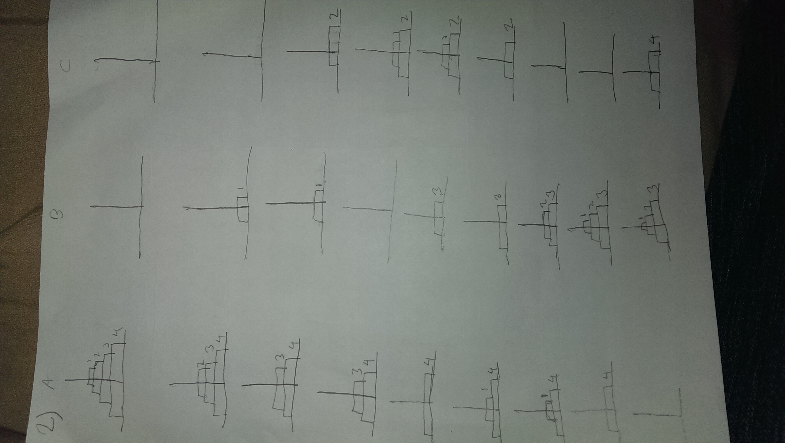

#Assignment 6

####Vincent Davis
_______________________________________________________________________________________________________________
##1

0301013601014020246


##2
Attached images


##3
```java

public class Palindrome{

	public static boolean palinCheck(String stuff){
		if(stuff.length() == 0 || stuff.length() == 1){
			return true;
		}
		else if(stuff.charAt(0) == stuff.charAt(stuff.length() - 1)){
			return palinCheck(stuff.substring(1, stuff.length()-1));
		}
		else{
			return false;
		}
	}

	public static void main(String[] args) {
		Scanner scan = new Scanner(System.in);
		System.out.print("Enter a String: ");
		String input = scan.nextLine();
		if(palinCheck(input))
			System.out.println("What you put is a palindrome");
		else
			System.out.println("what you put is not a palindrome");
	}
}

```
##4


##5
```Java
public int count7(int n){
		if(n == 0){
				return 0;
		  	}
    	if (n%10 == 7)  
    		return 1 + count7(n/10);
    	else
    		return 0 + count7(n/10);
	}
```
